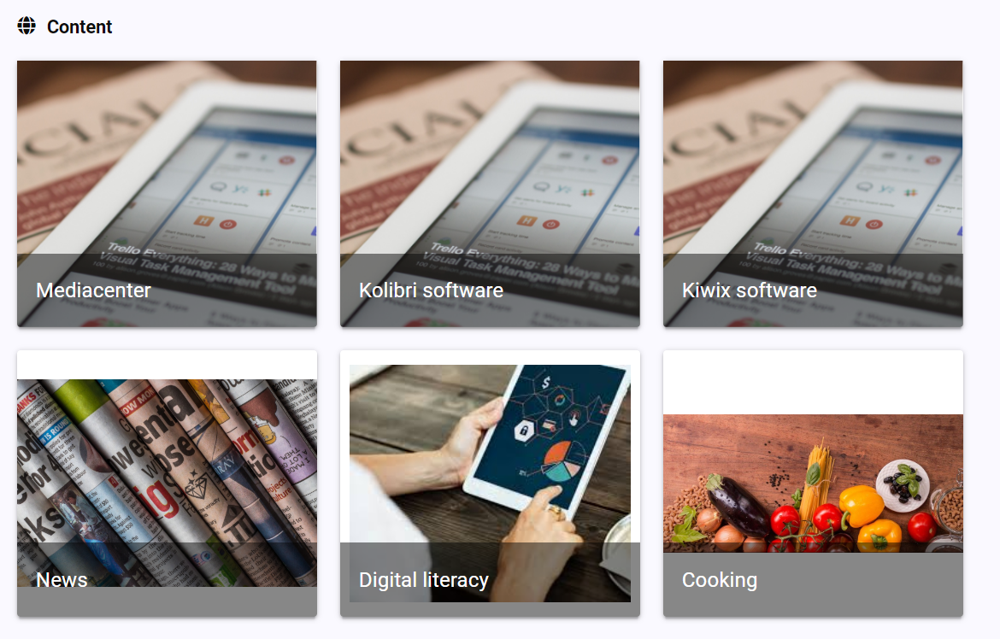
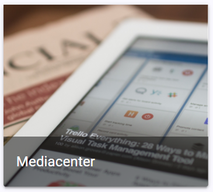
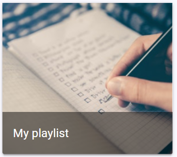

Content inside the homepage is the same whatever you are logged in or not. 

You can find in this order: 

|                                                              |                                                              |
| ------------------------------------------------------------ | ------------------------------------------------------------ |
|  | **applications** It is possible to hide application card in the application configuration page. |
|  | **categories** The thumbnail and the name can be changed by the admin. |
|  | **playlists** The thumbnails is always this one. The name can be changed by the creator of the playlist.  An admin can display or not a playlist on the homepage.   A logged in user will see playlists created by an admin and the ones he has created. A non logged in user will see playlists created by an admin. |

