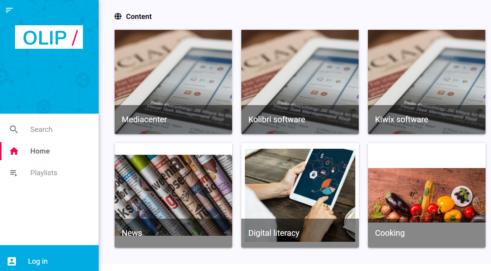
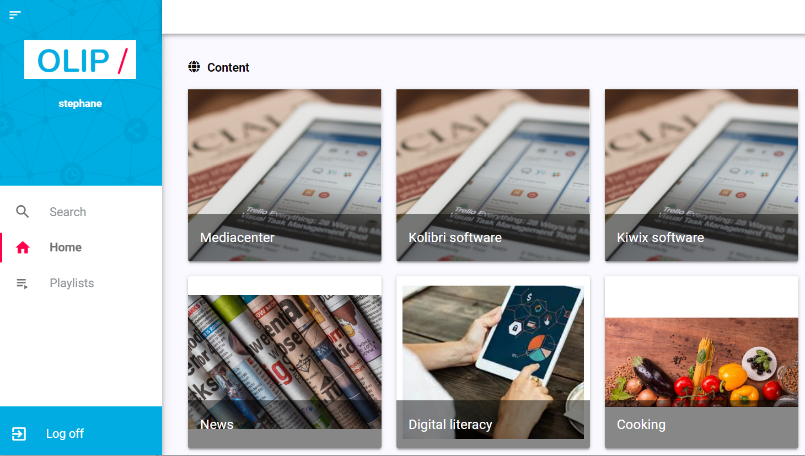
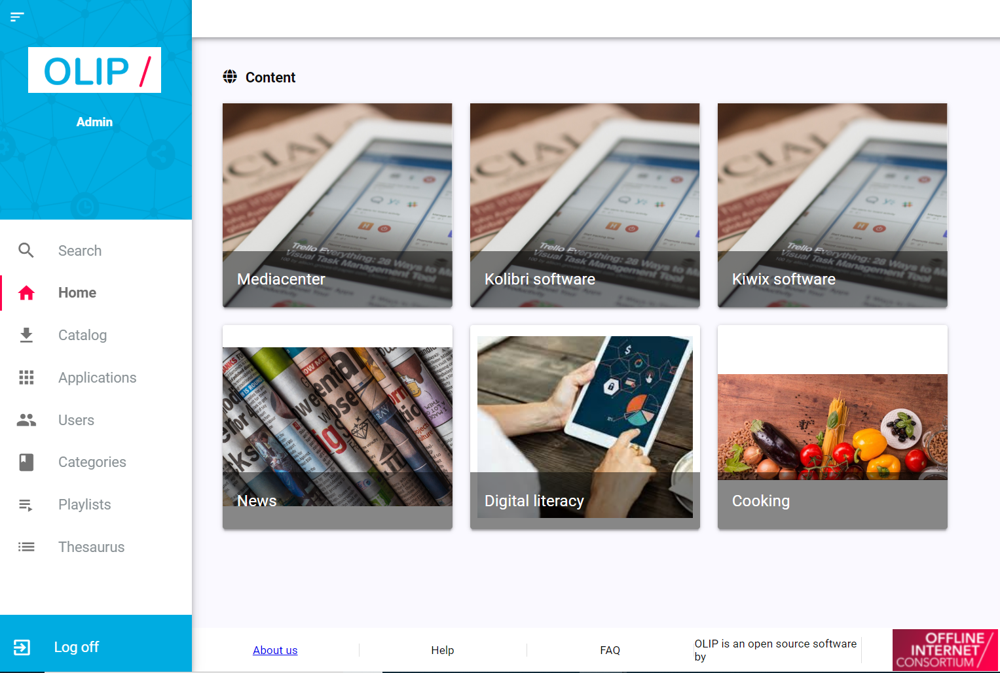

## Not being logged in

Different functionalities are accessible on that menu : 

|                                                              |                                                              |
| ------------------------------------------------------------ | ------------------------------------------------------------ |
|  | hide and display the OLIP menu.                              |
|  | display the search engine page.                              |
|  | go back to the homepage.                                     |
|  | go on the playlist configuration page.  Need to have an account and to be logged in. |
|  | log in.                                                      |

## Being logged in as a user

## 

Same functionalities are accessible on that menu + : 

|                                                              |            |
| ------------------------------------------------------------ | ---------- |
|  | user name. |
|  | log off.   |

## Being logged in as an admin

Same functionalities are accessible on that menu + : 

|                                                              |                                                              |
| ------------------------------------------------------------ | ------------------------------------------------------------ |
|  | go on the catalog page. Contains the list of the applications available on OLIP to be downloaded. |
|  | go on the application page to see the list of the applications donwloaded and to configure all the application installed. |
|  | go on the user administration page.                          |
|  | go on the category configuration page.                       |
|  | go on the thesaurus configuration page to find and add tags that you can assign to categories. |
|                                                              |                                                              |