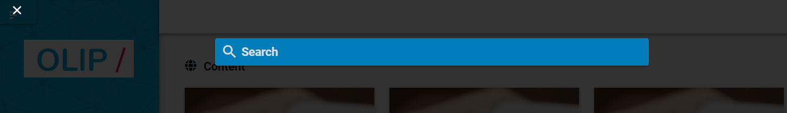
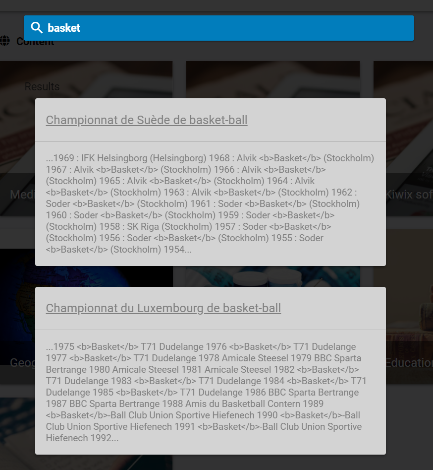

The search engine is available clicking on  : 

Then it opens a popup where you can enter your keyword : 

The search engine will look into each app of OLIP that has enabled OLIP to search inside its content. This is already the case for the meadiacenter and Kiwix. 

Results will appear below the search field application per application.  

Click on the title of a content to open it inside the correspondinn application.

To close this search page, just click on the cross at the top left corner of the window.