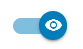

The application page many possibilities to manage applications and their content. 

## Downloaded application

First part of the page is about downloaded application. This is the list of the applications that have been downloaded but not yet installed. 
2 options : 

- click on the 'play' button to install the application. It can take several minutes to process the job. 
- or click on the 'trash' to uninstall the application. 

Please use the search field or the pagination in case of many applications available.

 

## Installed application

Here you have access to many options to manage your applications : 

|                                                              |                                                              |
| ------------------------------------------------------------ | ------------------------------------------------------------ |
|  | **upgrade** When an upgrade of an application is available, this icon is shown. Just click on it to upgrade the application. |
|  | **content** Click on this icon to manage the content of your application. See more details here : [content page](Content.md). |
|  | **order** If applications are visible, they will be displayed on the homepage of OLIP. Order will give the information of the rank of each application on the homepage. Click on the rows to put it up or down.   |
|  or  | **visible** If the icon is blue it means that the application will be displayed on the homepage and its content eventually in categories or playlists.  If the icon is grey it means that the application won't be displayed on the homepage. Its content added to categories or playlists will be also hidden. |
|  | **delete** This button desintalls the application. This task can take few minutes to be achieved. |

