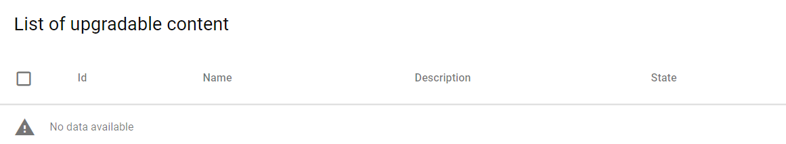

The content page gives you the possibility to intall, desinstall or upgrade content inside an application. 

## List of available content

In this part you can find all the available content of the app that is not installed.

Just tick the box () in the first line of the chart to select all the content available or the box at the left of each content. Then click on  above the chart.

You can follow the status of the installation :

When the content has been well installed, it will appear in the part 'List of installed content'

## List of installed content

Same process here to uninstall one or several piece of content ticking the checkbox then clicking on

Please follow the state of the desinstallation. After the step, the content will be displayed in the 'List of available content'.

## List of upgradable content

If a new version of a content is available, it will be displayed in this part. You would have the possibility to install this new version of the content. 

