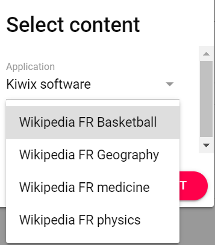
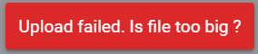

The category page gives you the possibility to create or edit an category. 
A category is a regroupment of playlists and/or apps and/or content. A category can be only created by an admin. It provide the opportunity for the admin to personalize the OLIP homepage for the final user.  

## Add a category

Clicking on , this screen will be displayed where you can configure your category :

|                         |                                                              |
| ----------------------- | ------------------------------------------------------------ |
| Label (en) & Label (fr) | Two labels are possible in case the language of the facilitator/admin and the one of the final users are not the same. The two labels are displayed on the homepage to make the title of the categorie understandable by different users. |
| Tags                    | Tags characterise the category. But they are not yet usable. We can imagine in future, developments that make possible to suggest a category in a search result relatively to the tags of the category. Entering few letters, OLIP will show you corresponding tags that are in the thesaurus. If there is no proposition, you can enter the tag you want. |
| Playlists               | A dropdown menu gives you the opportunity to search or to choose one or several playlist(s) you want in your category. |
| Applications            | A dropdown menu gives you the opportunity to search or to choose one or several application(s) you want in your category. |
| Content                 | Click on to open a new layer where you could choose first the application and then a piece of content from this application. You can choose one piece of content at a time.   |

## Edit a category

Click on 'More' then 'Edit' inside a card ( )  to display the configuration page of the category :

|                         |                                                              |
| ----------------------- | ------------------------------------------------------------ |
| Label (en) & Label (fr) | Change the name of the two labels                            |
| Tags                    | Add or delete tags clicking on the cross at the right of the tag :  |
| Playlists               | Add or unselect one or several playlist(s)                   |
| Applications            | Add or unselect one or several application(s)                |
| Content                 | Add new content or click on the red trash at the right to delete piece of content from your category:  |

## Add a thumbnail

By default the thumbnails of your category that is displayed on the homepage will be this one : 

This is possible to personalize the thumbnail of a category clicking on 'Upload thumbnail': 

This screen is displayed : 

Click on to select an image and then on to upload the image in OLIP. Thumbnails have to be lighter than 500 kB.

Please check that there is no notification at the bottom of the screen due to a file too heavy : 

