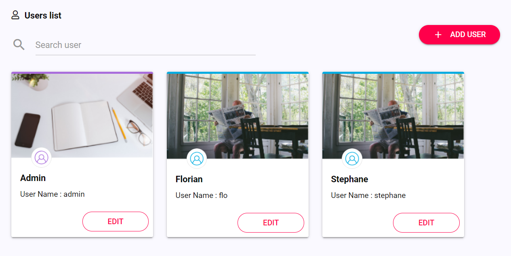
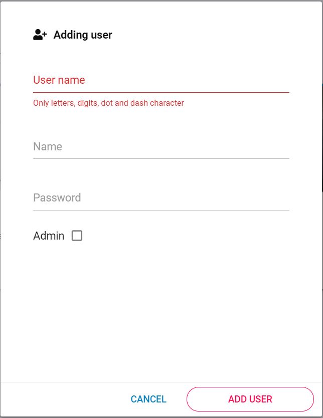
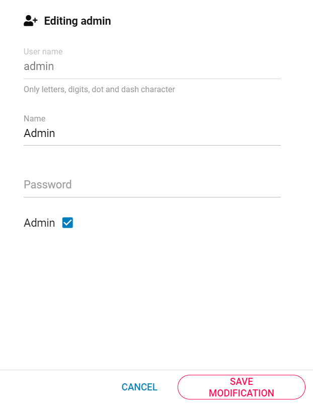

On this admin page, you can search, edit or add user on OLIP. 

A search engine is available to look for a specific user. 

## Admin or user?

You can distinguish Admin and User by the thumbnail and the colour of the line at the top of the card : purple (for admin) and blue (for user).

Here are the different accesses an admin or a user has : 

| Admin                                                        | User                                          |
| ------------------------------------------------------------ | --------------------------------------------- |
| Search Homepage Catalog Applications Users Categories Playlists  Thesaurus Log in | Search Homepage Playlists  Log in |

## Create a user

Click on  at the top right corner of the user page to open this page : 

where you can enter :  

|               |                                                              |
| ------------- | ------------------------------------------------------------ |
| **User name** | the user name containing only letters, digits, dot and dash character. You won't be able to change this user name after the creation of the user. |
| **Name**      | the name of the user.                                        |
| **Password**  | the password of the user.                                    |
| **Admin**     | the right of the user : admin or user.                       |

## Edit a user

When you click on the edit button, you have access to this page : 

where you can :  

|              |                                               |
| ------------ | --------------------------------------------- |
| **Name**     | change the name of the user.                  |
| **Password** | change the password of the user.              |
| **Admin**    | change the right of the user : admin or user. |
